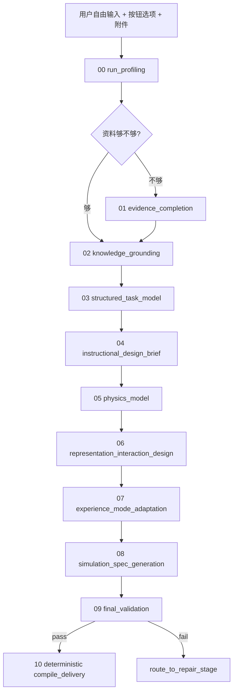

# Physics Problem-to-Simulation Agent 技术方案 v2

日期：2026-04-19
状态：整合版 / 可直接作为架构与 skill pack 基线

---

## 0. 这版文档相对上一版的关键升级

这版不是简单重写，而是把前面几轮讨论真正落到了 **可实现的 agent runtime 设计** 上，重点升级有 6 个：

1. **把“分流”正式定义成信息状态判断，而不是关键词分类。**
2. **把 teacher_demo / student_exploration / hybrid 正式升成显式适配阶段。**
3. **把 stage graph、repair graph、compile graph 三者拆开。**
4. **把上下文管理从“默认整段会话累积”改成 artifact 白名单注入。**
5. **把 skill、validator、repair 三类文档都设计成可单独加载的运行单元。**
6. **把最终 simulation 质量控制拆成生成手册和评分手册两套系统。**

---

## 1. 一页看懂整个系统



### 1.1 三个核心思想

#### 思想 A：固定主骨架，但允许条件子流程

系统必须是 **可控** 的，所以主 stage graph 要固定。

但输入资料丰富度不同，如果让所有 run 都死走一模一样的流程，就会产生大量无谓工作。因此：

- 主骨架固定；
- 是否执行 `evidence_completion` 由 `run_profiling` 决定；
- 是否走 teacher/student/hybrid 适配由 `experience_mode` 决定；
- 是否回退由 validator / final validation 决定。

#### 思想 B：simulation 先解决教学问题，再考虑视觉形式

高质量 simulation 不是“做一个会动的东西”，而是先回答：

- 学生哪里不会；
- 学生可能有哪些迷思；
- 需要出现哪些可见证据；
- 教师要如何借此解释、停顿、比较、提问；
- 学生要如何操作、观察、修正认知。

所以 `instructional_design_brief` 必须放在 `physics_model` 和 `representation_design` 之前，而不是最后补说明。

#### 思想 C：compile 是 deterministic compiler，不是 reasoning stage

只要 `final_validation.ready_for_generation=true`，系统就应该能稳定产出：

- `simulation_blueprint`
- `renderer_payload`
- `delivery_bundle`

这一步不应该交给模型自由发挥，而应该交给确定性 compiler。

---

## 2. 输入层设计：保持自由输入，但补充稳定信号

### 2.1 前端输入策略

默认仍然是：

- 一个自由文本输入框；
- 支持附件上传（截图、PDF、docx、现有 simulation 文件）；
- 不强制用户填复杂表单。

但为了让 agent 更稳定，前端建议显式增加 4 类按钮型信号：

1. 使用场景：`teacher_demo` / `student_exploration` / `unspecified`
2. 是否已有 simulation 待修改：`yes/no`
3. 教学阶段：如“新授 / 复习 / 习题讲评 / 自主探究”
4. 是否已有参考答案/解析：`yes/no/unknown`

这些按钮不是取代自由输入，而是补充稳定控制信号。

### 2.2 输入状态不是“题型标签”，而是“信息状态”

建议把最初分流定义成下面 5 类状态：

- `goal_only`
- `problem_only`
- `problem_with_solution`
- `revision_existing_simulation`
- `hybrid`

这里的本质不是自然语言分类，而是判断当前材料是否足够支持下一阶段。

---

## 3. run_profiling：先判断资料充分度，再决定流程

### 3.1 这个阶段一定要做什么

`run_profiling` 是全链路的流量总闸，必须回答 8 个问题：

1. 当前输入更像 `goal_only`、`problem_only`、`problem_with_solution` 还是 `revision`？
2. 信息密度是 low / medium / high？
3. 有没有显式题目？
4. 有没有显式答案与解析？
5. 有没有附件里的关键图示？
6. 有没有已有 simulation 文件？
7. 当前更适合 teacher_demo 还是 student_exploration？
8. 下一阶段最合理是补资料，还是直接 grounding？

### 3.2 推荐输出示例

```json
{
  "input_profile": "problem_only",
  "run_mode": "generate_from_problem",
  "information_density": "medium",
  "experience_mode": "student_exploration",
  "needs_external_completion": true,
  "needs_solution_generation": true,
  "needs_solution_verification": true,
  "missing_context": [
    "缺少可信标准答案",
    "附件图示尚未解析"
  ],
  "next_stage_plan": [
    "document.describe_diagram",
    "evidence_completion",
    "knowledge_grounding"
  ]
}
```

### 3.3 为什么不能用关键词硬编码替代

因为“有解析”不代表“给定解析一定可信”；
“帮我改一下这个 simulation”也不一定意味着只改 UI，不改 physics。

更稳的做法是：

- 由模型在 skill 约束下做语义判断；
- 程序只读取结构化结果，做流程控制。

---

## 4. 条件子流程：什么时候补资料，什么时候直接进入 grounding

### 4.1 `goal_only`

典型输入：

> “给我做一个自由落体 simulation。”

处理逻辑：

1. 补课程背景、概念边界、典型迷思；
2. 形成概念型 grounding；
3. 再进入 task / instructional / physics / representation。

### 4.2 `problem_only`

典型输入：

> “只给一道题，没有答案和解析。”

处理逻辑：

1. 若可找到可信参考答案，作为候选解并验证；
2. 若找不到，则系统自己求解并做验证；
3. 在确认解题基准可信后，才继续做 simulation。

### 4.3 `problem_with_solution`

典型输入：

> “题目、答案、解析都给了。”

处理逻辑：

1. 不直接相信给定解析；
2. 在 grounding 阶段做交叉验证；
3. 若解析不一致，记录问题并切换到“provided_but_inconsistent”状态。

### 4.4 `revision_existing_simulation`

典型输入：

> “这是我现有的 simulation，帮我改成更适合课堂演示。”

处理逻辑：

1. 在 `run_profiling` 中解析旧 simulation；
2. 在 `knowledge_grounding` 中确认旧 simulation 的 physics / representation 有哪些可保留项；
3. 在 `structured_task_model` 中明确 delta request；
4. 后续只重做必要部分，而不是整条链推倒重来。

---

## 5. 正式推荐的 stage graph

| ID | Stage | 必要性 | 主要输出 | 备注 |
|---|---|---|---|---|
| 00 | run_profiling | 必做 | run profile | 流量总闸 |
| 01 | evidence_completion | 条件执行 | 补全证据包 | 只在资料不足时执行 |
| 02 | knowledge_grounding | 必做 | 知识基准 / 题解基准 | 决定后面是否可信 |
| 03 | structured_task_model | 必做 | 结构化任务模型 | 拆 givens/unknowns/constraints |
| 04 | instructional_design_brief | 必做 | 教学设计简报 | 明确要解决的教学问题 |
| 05 | physics_model | 必做 | 物理模型 | 产出 executable constraints |
| 06 | representation_interaction_design | 必做 | 表征与交互设计 | 决定让什么“可见” |
| 07 | experience_mode_adaptation | 必做 | teacher/student 适配 | 明确使用场景差异 |
| 08 | simulation_spec_generation | 必做 | simulation spec | 可供 compiler 消费 |
| 09 | final_validation | 必做 | 通过/失败 + 回退建议 | 总门禁 |
| 10 | compile_delivery | 仅 pass 时执行 | blueprint / payload / bundle | 确定性编译 |

---

## 6. 每个阶段的实现要点

### 6.1 `02_knowledge_grounding`

这是整个系统最容易被低估、但最关键的阶段之一。

它不是“查一点资料”，而是建立 **可验证基准**：

- 题解是否可信；
- 概念边界是否清晰；
- 课标定位是否明确；
- 关键假设是否显式；
- revision 模式下哪些旧结构可保留。

如果这个阶段质量差，后面再漂亮的 simulation 也可能是建立在错误基准上。

### 6.2 `04_instructional_design_brief`

这是本方案与“纯 physics generator”最不同的地方。

这个阶段必须产出：

- `teaching_goal`
- `target_misconceptions`
- `evidence_goals`
- `teacher_moves`
- `student_actions`
- `success_criteria`

否则后面的 representation 和 interaction 会退化成“有点好看，但不解决教学问题”。

### 6.3 `06_representation_interaction_design`

这一阶段要回答：

- 哪些量必须可见；
- 哪些变化必须能被比较；
- 哪些控件应该开放给用户；
- 哪些逻辑应留在后台，不需要显式暴露；
- 哪些表征形式会更少误导。

这一步不应该被 scene template 直接取代。

### 6.4 `07_experience_mode_adaptation`

这一步是本版新增的重要显式阶段。

同一个 physics 过程，如果用在：

- 课堂投影演示；
- 学生课后自主探索；

它们的布局、控件开放度、引导语、反馈节奏、assessment hooks 本质上都应该不同。

所以 v2 不建议把它混在 representation_design 内部隐式处理，而是显式做成一个 stage。

---

## 7. Validator 体系：不是只有最后总评

### 7.1 每个关键阶段都要有 validator

标准模式：

```text
生成 -> validator -> pass 则前进 / fail 则 repair -> 再 validator
```

validator 输出至少要包含：

```json
{
  "pass": false,
  "repairable": true,
  "score": 72,
  "issues": [
    {
      "code": "MISSING_ASSUMPTION",
      "severity": "major",
      "field_path": "assumptions",
      "message": "未明确忽略空气阻力这一关键假设",
      "repair_hint": "补充边界假设，并说明模型适用条件"
    }
  ],
  "hard_blockers": [],
  "repair_hint": "..."
}
```

### 7.2 validator 分两层

#### 层 1：stage-specific validator

每个阶段一份 validator，专门检查本阶段契约。

#### 层 2：global quality rubric

在 `09_final_validation` 中使用统一评分手册，检查：

- physics fidelity
- pedagogical usefulness
- evidence visibility
- interaction quality
- spec executability
- UX discipline

---

## 8. Repair 体系：修本阶段，不重跑全链路

### 8.1 repair 必须注入的内容

repair 时只带三类东西：

1. 上一轮 artifact；
2. validator 输出；
3. repair skill。

不需要把所有历史内容重新拼回去。

### 8.2 repair 的目标

repair 不是重新从零生成，而是：

- 保留已正确部分；
- 定点修复关键问题；
- 重新满足本阶段 schema 和 rubric。

### 8.3 回退策略

`final_validation` fail 时，不应该自己“修复自己”，而是给出：

- 建议回退 stage；
- 问题类型；
- 优先修复项。

例如：

```json
{
  "ready_for_generation": false,
  "suggested_repair_stage": "06_representation_interaction_design",
  "retry_recommendations": [
    {
      "issue_code": "EVIDENCE_NOT_VISIBLE",
      "why": "目标教学证据在当前可视化中不可观察",
      "fix_at": "06_representation_interaction_design"
    }
  ]
}
```

---

## 9. Context Manager：这是 runtime 工程核心，不是附属品

### 9.1 为什么必须显式做

标准 API 默认不会自动记住上一次请求内容。

所以系统要自己管理：

- 当前阶段要看哪些 artifact；
- repair 时要额外看哪些 validator 反馈；
- 哪些旧信息该删掉；
- 当上下文变长时如何压缩。

### 9.2 最推荐的最小可行模式

每个阶段只拿：

- 本阶段 skill；
- 白名单 artifact；
- 输出 schema；
- 必要按钮信号；
- 若是 repair，再加上一轮 validator 反馈。

这比“把整段会话无限叠加”更稳，也更容易调试。

### 9.3 压缩策略

优先级必须是：

1. 删字段；
2. 删无关自由文本；
3. 保留结构化 JSON；
4. 最后才做摘要压缩。

---

## 10. Skill Registry / Validator Registry / Repair Registry

建议把 skill pack 分成 4 层：

1. `common/`：全局手册和模板
2. `00_xxx/`：每个 stage 的 `stage_contract.md`
3. `skill.md`：生成用 skill
4. `validator.md` + `repair.md`：验收与修复

这样程序侧只需要：

- 根据 `stage_name` 自动加载文件；
- 组装 prompt；
- 写回 artifact / trace / validation。

---

## 11. teacher_demo 与 student_exploration 的明确差异

| 维度 | teacher_demo | student_exploration |
|---|---|---|
| 控件数量 | 少而关键 | 可稍多，但必须有引导 |
| 布局 | 适合投影展示 | 适合个人操作 |
| 节奏 | 便于停顿、比较、讲解 | 便于尝试、回退、重复操作 |
| 文案 | 更像教师提示与课堂提问 | 更像学生操作反馈与探索问题 |
| assessment hooks | 偏课堂提问与讨论点 | 偏操作后自检与观察记录 |
| 风险 | 过度工具化会拖慢讲解 | 过度脚本化会抑制探索 |

### 11.1 一个自由落体例子

#### teacher_demo 版

- 左侧一个简洁场景：球下落；
- 右侧显示 `t`、`v`、`s` 的关键量；
- 控件只有：重置、开始/暂停、显示速度向量；
- 预设 pause 点：`t=1s`、`t=2s`；
- 教师可用来问：“速度变化为什么越来越快？”

#### student_exploration 版

- 开放更多变量：初速度、重力加速度、显示图像；
- 学生可以多次试验并比较；
- 系统提供反馈：“你刚刚改变了 g，观察 v-t 图像斜率怎么变？”
- 可以附带记录观察结果的轻量面板。

---

## 12. 最终质量门禁建议

### 12.1 评分维度

- Physics fidelity：25
- Pedagogical usefulness：20
- Evidence visibility：15
- Interaction quality：15
- Spec executability：15
- UX discipline：10

### 12.2 必须阻断的情况

以下任一情况出现，就不该 compile：

1. 关键 physics relation 错误；
2. 目标教学证据不可见；
3. 有 orphan controls；
4. spec 缺少关键 runtime 行为；
5. teacher/student 模式适配明显错位；
6. 关键假设未显式说明。

---

## 13. 运行时抽象：建议落成的代码组件

### 13.1 核心组件

- `StageRegistry`
- `SkillRegistry`
- `ValidatorRegistry`
- `RepairRegistry`
- `ContextManager`
- `StageExecutor`
- `ValidatorExecutor`
- `ArtifactStore`
- `TraceStore`
- `ValidationStore`
- `CompilerRuntime`

### 13.2 建议接口

```python
class StageContract(BaseModel):
    name: str
    input_artifacts: list[str]
    allowed_tools: list[str]
    output_schema_ref: str
    validator_ref: str
    repair_ref: str | None = None
    max_attempts: int = 2
    conditional: bool = False
```

```python
class ValidationIssue(BaseModel):
    code: str
    severity: str
    field_path: str
    message: str
    repair_hint: str | None = None
```

```python
class ValidationResult(BaseModel):
    pass_: bool
    repairable: bool
    score: int
    hard_blockers: list[str]
    issues: list[ValidationIssue]
    repair_hint: str | None = None
```

---

## 14. 代码落地优先顺序

最值得先落地的顺序是：

1. `run_profiling` + `evidence_completion`
2. `knowledge_grounding`
3. `structured_task_model`
4. `instructional_design_brief`
5. `physics_model`
6. `representation_interaction_design`
7. `experience_mode_adaptation`
8. `simulation_spec_generation`
9. `final_validation`
10. deterministic compiler

原因很简单：

- 前 4 步决定“做的是不是对的事情”；
- 中间 3 步决定“物理和教学能否真正落地”；
- 后 3 步决定“能不能高质量交付”。

---

## 15. 这版方案最重要的一句话

> 这套 agent 不是用关键词把输入分到几个模板里，而是用 skill 约束下的结构化判断来识别信息状态，再通过固定 stage graph、阶段 validator、局部 repair 和显式上下文管理，把 physics、pedagogy、representation 和 compile 逐步压实成可交付的 simulation。

---

## 16. 本次交付物说明

除这份总技术文档外，已经同步配套了一整套 skill pack，包含：

- 每个 stage 的 `stage_contract.md`
- 每个 stage 的 `skill.md`
- 每个 stage 的 `validator.md`
- 每个 stage 的 `repair.md`
- 每个 stage 的 `output_schema.json`
- `common/` 下的全局手册、模板、上下文管理与工具注册说明

这意味着你现在不仅有“想法”，而且已经有一套可直接放进仓库、继续喂给实现模型或 Codex 的运行规范底稿。
