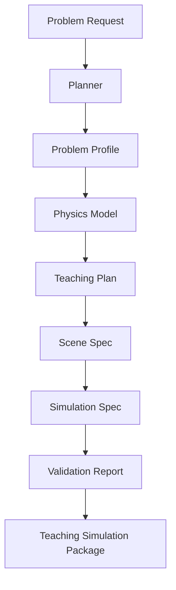
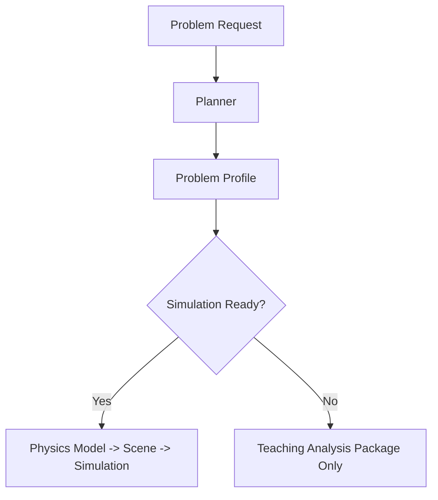

# Problem-to-Simulation Harness Design

## Goal

在 `physics-problem-to-simulation` 项目内部建立一套可复用的 GAI harness，使系统能把一条物理题目输入逐步转化为“可用于教学该题的 simulation 资产”，而不是依赖单次 prompt 直接生成最终结果。

这套 harness 的职责不是取代项目本身，而是作为项目内部的“受控执行器”：

`problem -> task plan -> structured artifacts -> validated scene -> teaching simulation package`

后续无论接 OpenAI、NVIDIA、Claude 还是本地模型，都应该复用这套 harness，只替换模型调用层。

---

## Recommended Approach

采用：

`单主管线编排器 + 多任务工件流 + 结构化日志 + 可替换模型执行器`

不采用：

- 单模型一步生成最终 simulation
- 一开始就做真正并发多 agent
- 把 prompt 当成核心资产

推荐原因：

1. 高中物理题目的教学 simulation 不是纯文本产物，而是由多个约束共同决定：
   - 物理正确性
   - 教学目标
   - 场景可视化限制
   - 仿真模板能力边界
2. 一步式生成很难同时满足这些约束。
3. 项目后续需要平台化，harness 必须可审计、可恢复、可替换模型。

---

## Core Principle

系统中的模型不直接“做 simulation”，模型只负责在受控任务中生产结构化工件。

真正的 simulation 产物由 harness 组装出来。

因此整套架构分成两层：

1. `Harness Orchestrator`
   - 负责任务拆分、上下文裁剪、日志记录、失败重试、工件衔接
2. `Model Worker`
   - 只处理当前任务
   - 只读取当前任务需要的最小上下文
   - 只输出结构化结果，不直接修改其他阶段工件

---

## Final Deliverable

对一条题目，最终输出不应该只是 `scene.json`，而应该是一个教学 simulation package：

1. `problem_profile`
   - 原题摘要
   - 题型标签
   - 研究对象
   - 教学目标
2. `physics_model`
   - 物理对象
   - 阶段划分
   - 受力/运动/约束
   - 易错点
3. `teaching_plan`
   - 此 simulation 用来讲什么
   - 教师如何使用
   - 学生应观察什么变量
4. `scene_spec`
   - 可视元素
   - 控件
   - 阶段切换
   - 数据映射
5. `simulation_spec`
   - 模板 id
   - 参数配置
   - 运行模式
   - 事件钩子
6. `validation_report`
   - 物理校验
   - 教学校验
   - 模板适配校验

---

## End-to-End Workflow

### Stage 0: Intake

输入：

- 原始题目文本
- 可选题源信息
- 可选教师意图

输出：

- `problem_request.json`

作用：

- 标准化入口
- 补充默认元信息
- 生成任务 id

### Stage 1: Problem Understanding

目标：

把题目从原始自然语言变成“可计算的题目画像”。

输出工件：

- `problem_profile.json`

包含：

- 研究对象
- 题型
- 主题
- 是否多阶段
- 已知条件
- 求解目标
- 是否适合直接映射到 simulation

这里允许模型参与，但必须输出 JSON，不能直接产出解释性散文。

### Stage 2: Physics Modeling

目标：

把题目画像转成物理模型。

输出工件：

- `physics_model.json`

包含：

- `stages`
- `force_cases`
- `state_transitions`
- `constraints`
- `core_principles`
- `misconceptions`

这是整个 harness 的核心工件。后面所有 scene 和教学资产都基于它生成。

### Stage 3: Teaching Design

目标：

确定“这个 simulation 在课堂里要承担什么教学任务”。

输出工件：

- `teaching_plan.json`

包含：

- 适用课型
- 本题教学目标
- 观察点
- 交互点
- 教师提示语
- 适合展示的错误想法

这里是你和普通仿真生成器拉开差距的关键。系统不是为了画图，而是为了服务教学。

### Stage 4: Scene Planning

目标：

把物理模型和教学设计映射到可渲染 scene。

输出工件：

- `scene_spec.json`

包含：

- template id
- visual elements
- controls
- stage selector
- overlays
- annotations

这一层仍然不直接写前端代码，只定义“应该渲染什么”。

### Stage 5: Simulation Compilation

目标：

把 scene spec 编译为项目前端能实际使用的 simulation 资产。

输出工件：

- `simulation_spec.json`

包含：

- 使用哪个 simulation 模板
- 模板参数
- 数据绑定
- 初始状态
- 展示模式

这里应该尽量走模板编译，而不是让模型直接写任意 TS/React 代码。

### Stage 6: Validation

目标：

校验最终产物是否可用于教学。

输出工件：

- `validation_report.json`

校验分三类：

1. 物理校验
   - 力是否漏列
   - 阶段切换是否合理
   - 模型是否自洽
2. 教学校验
   - 是否对准题目核心难点
   - 是否有明确观察任务
   - 是否避免误导
3. 模板校验
   - 是否超出当前模板能力
   - 是否有未绑定参数

### Stage 7: Package Output

目标：

输出给平台层可直接消费的资产包。

输出工件：

- `teaching_simulation_package.json`

---

## Harness Roles

第一版不需要真的启动多个 agent，但要先把角色边界定义出来。

### 1. Planner

职责：

- 根据 `problem_request` 决定需要跑哪些任务
- 决定是否走多阶段分支
- 决定是否能进入 simulation 分支

输入：

- 原始题目
- 题型 hint

输出：

- `task_plan.json`

### 2. Parser Worker

职责：

- 解析题目文本
- 输出题目画像

只看到：

- 原始题目
- 基础 schema

### 3. Modeler Worker

职责：

- 输出物理模型

只看到：

- `problem_profile`
- 物理模型 schema

### 4. Pedagogy Worker

职责：

- 生成教学使用说明

只看到：

- `problem_profile`
- `physics_model`

### 5. Scene Builder Worker

职责：

- 从模型与教学目标生成 scene 规范

只看到：

- `physics_model`
- `teaching_plan`
- 可用模板列表

### 6. Validator Worker

职责：

- 给出结构化校验结果

只看到：

- `physics_model`
- `scene_spec`
- `simulation_spec`

这就是你前面提到的“主 agent 只保留任务和结果摘要，子 agent 只执行具体任务”的架构映射。

---

## Context Management

模型不能拿全量上下文工作，而应该按任务最小化上下文。

每个 worker 的输入上下文固定由三部分组成：

1. `task_brief`
   - 当前任务是什么
   - 必须输出什么 schema
2. `artifact_inputs`
   - 当前任务允许读取的上游工件
3. `constraints`
   - 学科限制
   - 模板限制
   - 输出格式限制

明确禁止：

- 让下游 worker 回看全部历史对话
- 让模型直接读取所有中间工件
- 让模型自己决定输出格式

---

## Logging and Recovery

每一步必须落日志，而不是只依赖对话历史。

日志最小结构：

- `run_id`
- `task_id`
- `task_type`
- `input_digest`
- `output_digest`
- `artifacts_written`
- `status`
- `error`
- `next_task`

建议每次运行都形成：

1. `runs/<run_id>/task_plan.json`
2. `runs/<run_id>/task_log.ndjson`
3. `runs/<run_id>/artifacts/*.json`
4. `runs/<run_id>/final_package.json`

这样即使任务中断，也可以直接从最近一个已完成工件恢复。

---

## Harness API Surface

项目内部建议最终形成以下接口：

### 1. `POST /api/problem-to-simulation/plan`

输入题目，返回任务计划和题目画像。

### 2. `POST /api/problem-to-simulation/run`

按计划执行整条链路，返回最终资产包。

### 3. `POST /api/problem-to-simulation/step`

只执行某一个任务，方便调试。

### 4. `GET /api/problem-to-simulation/runs/:run_id`

返回某次运行的日志和工件。

### 5. `GET /api/problem-to-simulation/runs/:run_id/artifacts/:name`

读取某个中间工件。

这样平台层后续不需要理解模型细节，只需要调 harness。

---

## Internal Task Graph

当某道题不适合直接做 simulation 时，Planner 应该允许分流：

这对“质点建模判断题”尤其重要。不是所有题都应该强行映射成 simulation。

---

## Template Strategy

simulation 不应该由模型直接临时写代码，而应该由模板系统承接。

第一版模板层建议只支持这几类：

1. `force-analysis-staged`
   - 接触/脱离接触
   - 飞行/碰撞/触网
2. `force-balance-single-stage`
   - 粗糙水平面
   - 斜面静力学
3. `modeling-judgement`
   - 能否视为质点
   - 只输出教学分析，不强行做动画

模型的任务是：

- 选择模板
- 填参数
- 定义阶段

不是：

- 任意生成仿真实现

---

## Prompt Strategy

prompt 不应按“产品页面”设计，而应按“任务 schema”设计。

每个任务 prompt 都固定包含：

1. 角色说明
2. 任务目标
3. 可读输入工件
4. 输出 JSON schema
5. 约束规则
6. 错误处理要求

示例原则：

- Parser prompt 只关心题目画像
- Modeler prompt 只关心物理建模
- Pedagogy prompt 只关心教学用途
- Scene Builder prompt 只关心模板映射

---

## How the Embedded GAI Should Work

如果把模型本身想象成“被你内嵌在项目里的 GAI worker”，它的工作方式应该是：

1. 主管线分配任务
2. harness 只给它当前任务需要的最小输入
3. 它输出结构化 JSON
4. harness 验证 schema
5. harness 把结果写成工件
6. 下一个 worker 读取工件继续

模型本身不负责：

- 决定整个流程
- 保存长期状态
- 管理日志
- 直接操作 Git
- 直接修改前端渲染代码

这些都属于 harness 和外层系统的职责。

---

## First Implementation Milestone

第一阶段建议只做这条最小可行链：

`受力分析题 -> problem_profile -> physics_model -> teaching_plan -> scene_spec -> simulation_spec`

限制：

- 仅限受力分析
- 仅限 2-3 个模板
- 仅限 JSON 工件
- 前端只做结构化预览

成功标准：

1. 输入一道浙江风格样题
2. 系统形成完整任务计划
3. 每一步产生可读工件
4. 最终得到一个可用于教学展示的 scene/spec
5. 运行记录可重放、可恢复

---

## Second Implementation Milestone

在第一阶段稳定后，再接入真实模型 API，并改成：

- rule-based parser 作为 fallback
- llm-enhanced parser 作为增强层
- validator 永远保留规则校验

这样就不会因为模型波动把整个系统变成黑箱。

---

## Repository Mapping

建议在当前仓库逐步形成如下目录：

- `backend/app/harness/`
  - `orchestrator.py`
  - `task_registry.py`
  - `artifact_store.py`
  - `run_logger.py`
- `backend/app/workers/`
  - `planner.py`
  - `parser.py`
  - `modeler.py`
  - `pedagogy.py`
  - `scene_builder.py`
  - `validator.py`
- `backend/app/prompts/`
  - `parser.md`
  - `modeler.md`
  - `pedagogy.md`
  - `scene_builder.md`
- `backend/app/templates/`
  - `force-analysis-staged.json`
  - `force-balance-single-stage.json`
  - `modeling-judgement.json`
- `runs/`
  - 每次运行的日志与工件

---

## Decision Summary

最终结论：

1. 把模型当作受控 worker，而不是万能 agent。
2. 把中间工件当作核心资产，而不是 prompt 文本。
3. 把 simulation 生成做成“模板编译”，而不是“自由代码生成”。
4. 把日志和恢复能力做成 harness 的一等公民。
5. 先在 `problem-to-simulation` 仓库里把这套 harness 跑通，再迁移到平台项目中作为模型编排内核。

这套设计的价值不在于今天就能生成所有题目的仿真，而在于后续无论平台怎么做，模型都被放在一个稳定、可控、可替换的位置上。
